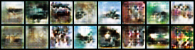
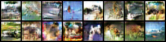

# BiGAN
This is my Minimal Pytorch implementation of [Adversarially Learned Inference](https://arxiv.org/pdf/1606.00704.pdf)/[Adversarial Feature Learning](https://arxiv.org/pdf/1605.09782.pdf) (BiGAN) (ICLR 2017).

# Results

Epoch 0:

Epoch 100:

Epoch 200:

